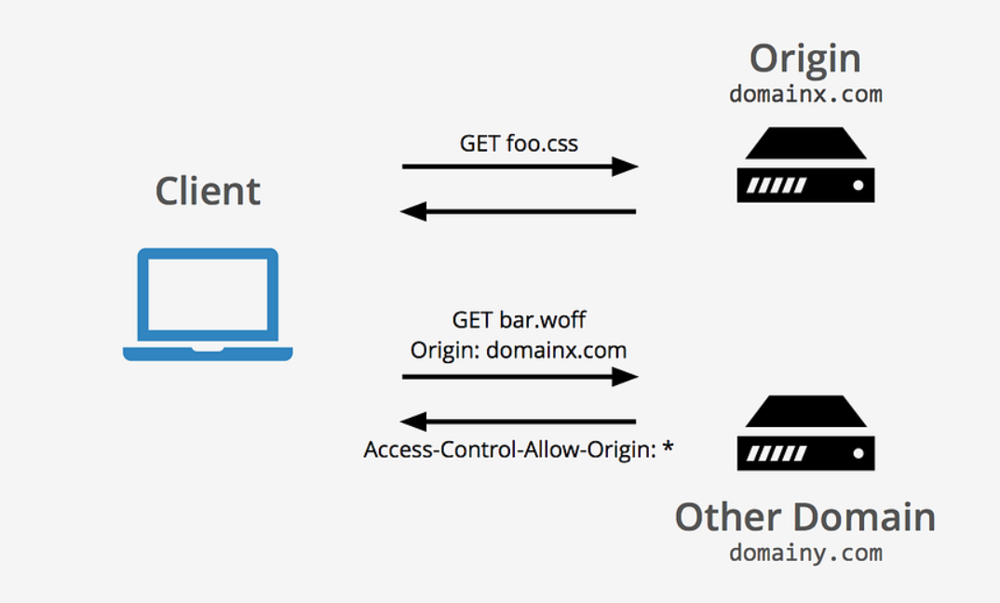

# CORS Setup

Cross-Origin Resource Sharing (CORS) is a security feature implemented by web browsers to prevent unauthorized domains from accessing resources on a server. Configuring CORS properly is essential for enabling communication between a frontend and a backend hosted on different origins.

## Why Configure CORS?

By default, web browsers block requests made from a different domain than the server's. This restriction can interfere with the development of web applications where the frontend and backend run on different ports or domains. CORS configuration in a Spring Boot application enables secure cross-origin requests.



## Global CORS Fix Configuration

To set up CORS globally in a Spring Boot application, a configuration class can be created. Below is an example implementation for RaiseHub.

### Code Example

```java title="com/fontys/crowdfund/config/WebConfig.java"
package com.fontys.crowdfund.config;

import org.springframework.context.annotation.Bean;
import org.springframework.context.annotation.Configuration;
import org.springframework.web.servlet.config.annotation.CorsRegistry;
import org.springframework.web.servlet.config.annotation.WebMvcConfigurer;

@Configuration
public class WebConfig implements WebMvcConfigurer {

    @Bean
    public WebMvcConfigurer corsConfigurer() {
        return new WebMvcConfigurer() {
            @Override
            public void addCorsMappings(CorsRegistry registry) {
                registry.addMapping("/**") // Allow all paths
                        .allowedOrigins("http://localhost:3000") // Allow only frontend origin
                        .allowedMethods("GET", "POST", "PUT", "DELETE") // Allow common HTTP methods
                        .allowedHeaders("*") // Allow all headers
                        .allowCredentials(true); // Allow credentials such as cookies
            }
        };
    }
}
```

### Breakdown of the Configuration

- **`@Configuration` Annotation**: Marks this class as a configuration class.
- **`@Bean` Annotation**: Registers a bean that provides CORS configuration.
- **`addCorsMappings` Method**: Configures allowed paths, origins, methods, headers, and credentials.

### Explanation of Key Settings

- **Allowed Paths (`addMapping("/**")`)**: This setting allows CORS requests on all API endpoints.
- **Allowed Origins (`allowedOrigins("http://localhost:3000")`)**: Restricts requests to the specified origin (frontend).
- **Allowed Methods (`allowedMethods(...)`)**: Defines supported HTTP methods.
- **Allowed Headers (`allowedHeaders("*")`)**: Permits all headers.
- **Allow Credentials (`allowCredentials(true)`)**: Enables sharing of cookies, authentication headers, and other credentials.

## Best Practices

- **Use Environment Variables**: Avoid hardcoding origins in production.
- **Limit Origins in Production**: Allow only trusted origins to access the API. (This is specially important)
- **Secure Headers and Methods**: Restrict methods and headers to minimize the application's attack surface.