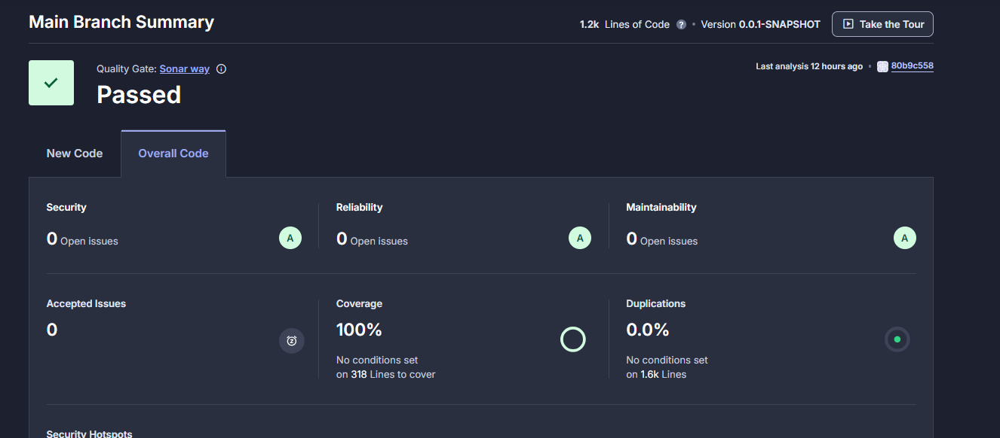

# SonarCloud Integration with GitHub Actions

## Overview

This guide explains the integration of **SonarCloud** with **GitHub Actions** to automate continuous analysis of code quality. It enables the tracking of security vulnerabilities, maintainability issues, and test coverage for your codebase, ensuring that it remains in optimal shape.

## Key Benefits of SonarCloud Integration:
- **Automated Code Analysis**: Continuous feedback is provided on code quality with every push or pull request.
- **Customizable Quality Gates**: The ability to define custom thresholds based on metrics like test coverage, security, and code duplication.
- **CI/CD Support**: Seamless integration into CI/CD pipelines, specifically GitHub Actions.
- **Clear Actionable Reports**: Detailed and understandable reports, available in SonarCloud’s dashboard, highlighting areas to improve.

## Steps

### 1. Setting Up SonarCloud

- First, create an account on [SonarCloud](https://sonarcloud.io/) if not done already.
- Create a new project in SonarCloud, following the platform’s instructions for linking it to a GitHub repository.

### 2. Configuring GitHub Repository Secrets

- In your GitHub repository, configure the following secrets:
  - `SONAR_TOKEN`: SonarCloud authentication token required for analysis.

### 3. Setting Up GitHub Actions Workflow

- Add a new GitHub Actions workflow file (`.github/workflows/sonarcloud.yml`) to your repository:

```yaml, title=".github/workflows/sonarcloud.yml"
name: SonarCloud Analysis
on:
  push:
    branches:
      - master
  pull_request:
    types: [opened, synchronize, reopened]
jobs:
  build:
    name: Build and Analyze
    runs-on: ubuntu-latest
    steps:
      - uses: actions/checkout@v4
        with:
          fetch-depth: 0  # Ensure full history for accurate analysis
      - name: Set up JDK 17
        uses: actions/setup-java@v4
        with:
          java-version: 17
          distribution: 'zulu'
      - name: Cache SonarQube packages
        uses: actions/cache@v4
        with:
          path: ~/.sonar/cache
          key: ${{ runner.os }}-sonar
          restore-keys: ${{ runner.os }}-sonar
      - name: Cache Gradle packages
        uses: actions/cache@v4
        with:
          path: ~/.gradle/caches
          key: ${{ runner.os }}-gradle-${{ hashFiles('**/*.gradle') }}
          restore-keys: ${{ runner.os }}-gradle
      - name: Build and Analyze with SonarCloud
        env:
          GITHUB_TOKEN: ${{ secrets.GITHUB_TOKEN }}  # Required for PR analysis
          SONAR_TOKEN: ${{ secrets.SONAR_TOKEN }}
        run: ./gradlew build sonar --info
```

### 4. Running the Workflow

- Push changes to the repository to trigger the GitHub Actions workflow.
- After execution, the SonarCloud analysis results will be available on the SonarCloud dashboard and within the GitHub Actions log.

### 5. SonarCloud Quality Gate

After the SonarCloud analysis, the project is subject to a **Quality Gate** that determines whether the code passes based on predefined criteria.

#### Key Quality Gate Conditions
SonarCloud's **Sonar Way** quality gate ensures that the following conditions are met for any new code:
- **No New Bugs**: No bugs should be introduced by the new code.
- **No New Vulnerabilities**: The new code must not contain security vulnerabilities.
- **Limited Technical Debt**: The new code should not create excessive technical debt.
- **Reviewed Security Hotspots**: All security hotspots in new code should be reviewed and resolved.
- **Test Coverage**: The new code must have at least 80% test coverage.
- **No Duplications**: Code duplication in the new code should be less than 3%.

#### Quality Gate Status

- **Passed**: The project is considered in good shape if all the conditions are satisfied.
- **Failed**: The project fails if any of the conditions (such as low test coverage or security issues) are violated.

##### Example Quality Gate Pass:


#### Customizing Your Quality Gate
The quality gate can be customized by adjusting the thresholds for various metrics like bugs, security vulnerabilities, and code coverage directly in the **Quality Gates** section of SonarCloud.

### 6. Monitoring Code Quality

SonarCloud provides continuous feedback by showing detailed insights and actionable information in GitHub Pull Requests (PRs). This helps to identify problem areas, guiding developers to focus on fixing critical issues and maintaining high code quality.

:::warning
- **Authentication**: Make sure GitHub secrets are configured correctly to prevent authentication issues.
:::