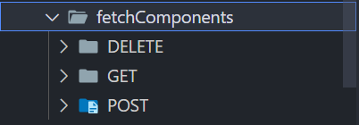

# Data Retrieval Components

The project has been structured to provide flexibility for future updates by implementing React components that manage data retrieval and communication with the back-end. This modular approach allows for easy adjustments or updates to the data-fetching logic without requiring significant changes to the rest of the codebase. As a result, it is easier to meet new requirements or make changes when needed.

## Folder organization
The components are organized into separate folders based on the HTTP method they use: **GET**, **POST**, and **DELETE**.



## Axios request example
Here is an example of how a **GET** request is structured:

```javascript
import axios from "axios";
import { DATA } from "@/app/data";
import TokenManager from "@/app/apis/TokenManager";

export default async function getProfilePictureGET(userId) {
    const response = await axios.get(`${DATA.origin}/users/picture/${userId}`, {
        headers: { Authorization: `Bearer ${TokenManager.getAccessToken()}` }
    });
    return response.data;
}
```