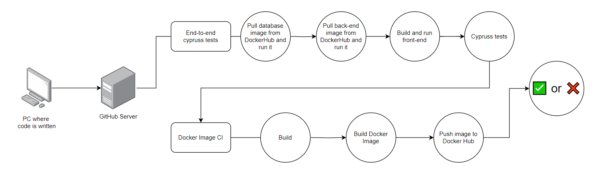

# Front-end pipeline diagram

1. **End to End Testing**:
   - **Pull and Run Database Docker Image**: The Docker image for the database is pulled and ran in order to set up the environment.
   - **Pull and Run Back-end Docker Image**: The Docker image for the back-end is pulled and ran in order to set up the environment.
   - **Frontend build and run**: The frontend is built and ran in order to set up the environment.
   - **Run Cypress**: Cypress is ran in order to test the application using the end-to-end testing strategy.

2. **Docker Image CI**:
   - **Build**: The pipeline builds the Docker image.
   - **Build Docker Image**: The Docker image is built.
   - **Push Image to Docker Hub**: The built Docker image is pushed to Docker Hub for storage.

5. **Final Outcome**:
   - If all steps succeed (End-to-End Testing, Docker), the pipeline passes ✅.      
   - If any step fails, the pipeline fails ❌.
      - In case any of the steps fails, all the next jobs are skipped and the pipeline fails.