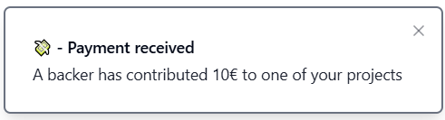

# WebSockets Implementation

This documentation outlines how WebSocket communication is used to manage project notifications in the application in the Front-end side.

[Back-end websockets implementation](../Backend/websockets.md)

---

## Install StompJS dependency

Install the dependency by using the following command:

```groovy
npm i @stomp/stompjs
```

---

## **1. Subscribing to Project Topics**

When a user logs in, the system automatically subscribes them to all WebSocket topics corresponding to the projects they own. This ensures they receive real-time notifications for payments related to their projects.

### **Implementation:**

```javascript
const setupStompClient = (projectIds) => {
    const client = new Client({
        brokerURL: 'ws://localhost:8080/ws', // WebSocket endpoint
        reconnectDelay: 5000, // Attempt reconnection every 5 seconds
        heartbeatIncoming: 4000, // Heartbeat for incoming messages
        heartbeatOutgoing: 4000, // Heartbeat for outgoing messages
    });

    client.onConnect = () => {
        projectIds.forEach((projectId) => {
            client.subscribe(`/projectws/${projectId}`, (data) => {
                onPaymentReceived(data); // Handle received payments
            });
        });
    };

    client.activate(); // Activate the WebSocket connection
    setStompClient(client); // Save the client instance for further use
};
```

---

## **2. Publishing Payments to Topics**

When a user makes a payment, the system publishes the payment details to the WebSocket topic associated with the project. For example, a payment for a project with ID `1` is sent to `/projectws/1`.

### **Implementation:**

```javascript
const sendMessage = (newMessage) => {
    if (!stompClient) {
        console.error("WebSocket client not initialized");
        return;
    }

    const payload = {
        id: uuidv4(), // Unique identifier for the message
        to: newMessage.to, // Project ID (topic destination)
        title: newMessage.title, // Title of the payment
        description: newMessage.description, // Description of the payment
    };

    stompClient.publish({
        destination: `/projectws/${payload.to}`, // Publish to the project's topic
        body: JSON.stringify(payload), // Serialize the payload
    });
};
```

---

## **3. Receiving Notifications**

If the project owner is online and subscribed to the corresponding WebSocket topic, they will receive a real-time notification. Notifications are displayed as a toast in the bottom-right corner of the screen.

### **Implementation:**

```javascript
const onPaymentReceived = (data) => {
    const toastMsg = JSON.parse(data.body); // Parse the received message

    // Display the notification
    toast({
        title: `${toastMsg.title}`,
        description: `${toastMsg.description}`,
    });
};
```

## **Example Notification:**
The notification appears as a toast message, as shown below:

