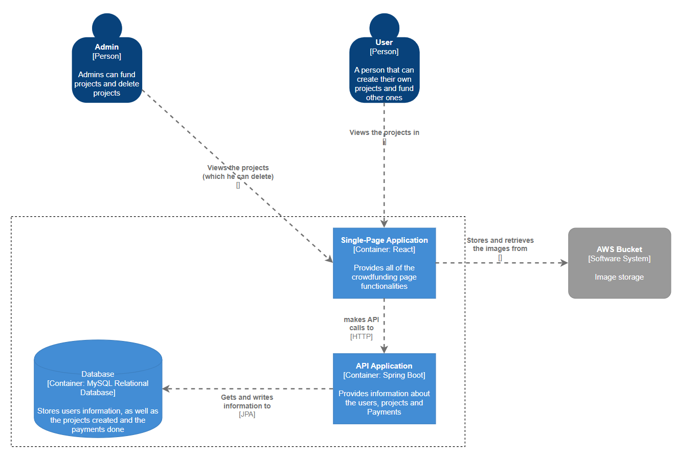

# C2: Container Diagram

The diagram provides a breakdown of the main containers that form the **"RaiseHub"** system and how they interact with each other. It includes user roles, containers for different system functionalities, and external dependencies. Here’s an analysis of each component in the diagram:

## Actors:
- **Admin [Person]**:  
  - Can view, fund projects,ban users and delete any projects in the system.  
  - Interacts with the system through the user interface.

- **User [Person]**:  
  - Can create new projects, fund projects, and view existing projects.  

## Containers:
1. **Single-Page Application (SPA) [Container: React]**:  
   - A front-end application built with React, providing all the functionalities for users to interact with the platform. This includes creating projects, funding projects, and viewing existing projects.
   - Communicates with the API Application through HTTP API calls to fetch or update information.
   - Provides a dynamic and responsive user experience.

2. **API Application [Container: Spring Boot]**:  
   - The backend service responsible for managing the business logic of the application.
   - Handles requests from the Single-Page Application and processes information related to users, projects, and payments.
   - Interfaces with the Database to store and retrieve data using JPA (Java Persistence API).

3. **Database [Container: MySQL Relational Database]**:  
   - Stores all persistent data, such as user details, project information, and payment transactions.
   - Interacts with the API Application, which retrieves and updates information through JPA.

## Software Principles applied:
1. **Single Responsibility Principle (SRP)**:  
   - Each container has a distinct and well-defined responsibility. For example, the API Application handles business logic, while the Single-Page Application is responsible for the user interface.

2. **KISS (Keep It Simple, Stupid)**:  
   - The architecture is kept simple by dividing the system into clear and manageable components. There’s a straightforward flow of data from the user interface to the backend and the database, with image storage managed separately.
