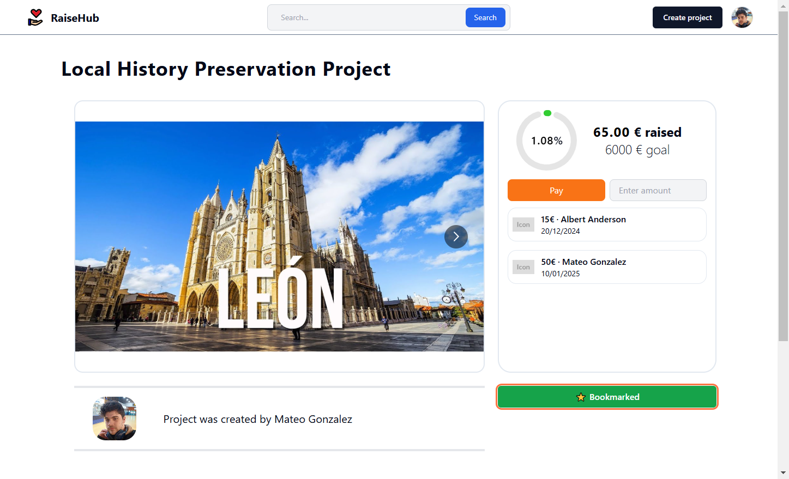

# How to bookmark Projects

## Prerequisites
To bookmark a project, ensure that:
- You are logged in. Refer to the [Login / Register guide](login_register.md).
- You have accessed the desired project page. Refer to the [Visit a Project guide](visit_a_project.md).

---

## Steps to Bookmark a Project

1. **Go to the Project Page**  
   Navigate to the project page of the project you wish to bookmark.

2. **Bookmark the Project**  
   Locate the bookmark button below the payments section.  
   - If the button is **red** and says "❌ Not Bookmarked," click it to bookmark the project.  

3. **Verify the Bookmark**  
   Once bookmarked, the button will turn **green** and display "⭐ Bookmarked."  

---

## Viewing Your Bookmarked Projects

1. **Access the Bookmarks Page**  
   Click on your profile picture in the navbar. From the dropdown menu, select the **Bookmarks** button.  

2. **View Your Bookmarked Projects**  
   The bookmarks page will display all your bookmarked projects, allowing you to easily revisit them.  

By bookmarking projects, you can conveniently track and revisit your favorite initiatives whenever needed.