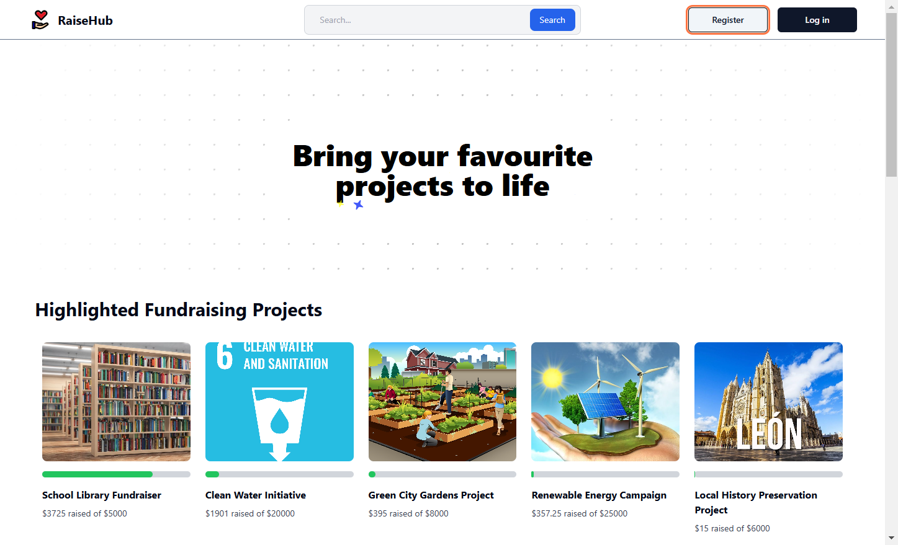
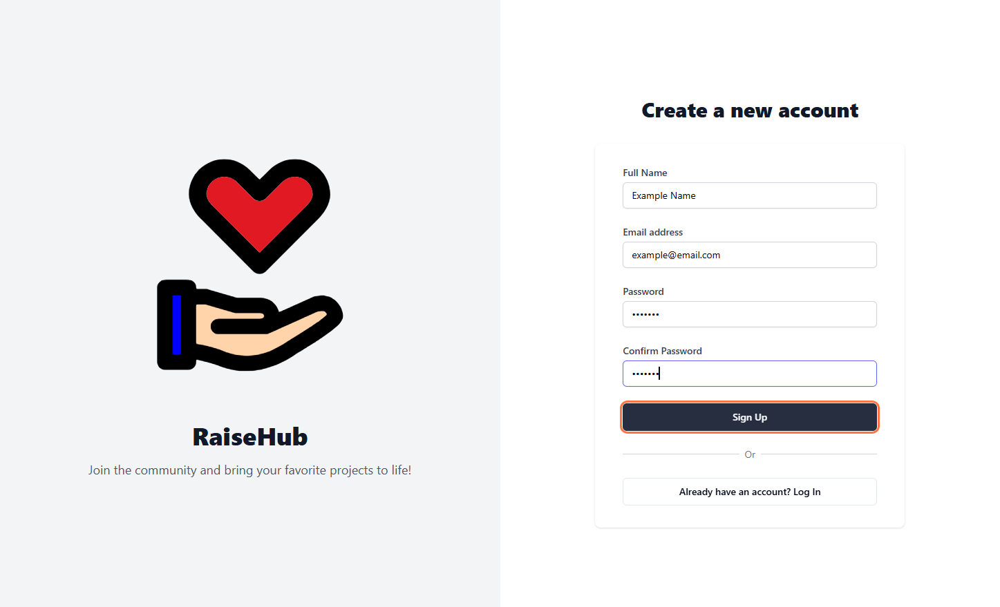
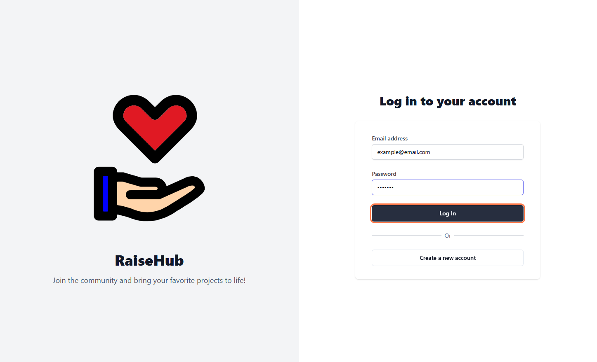
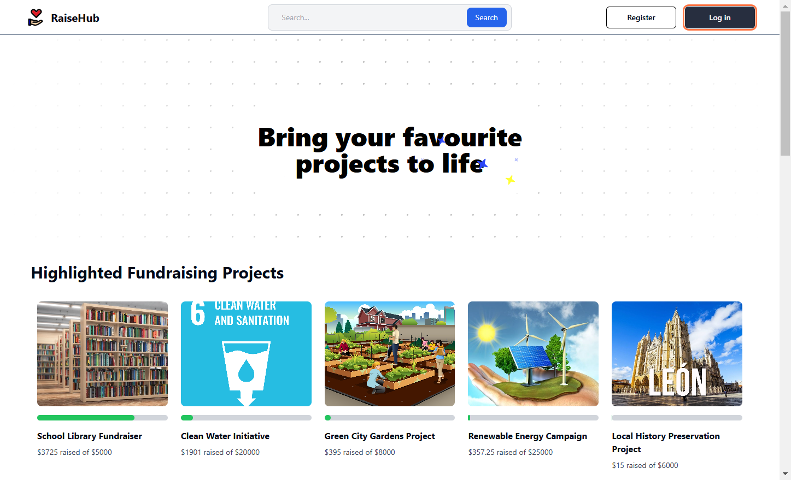

# How to Login / Register

This guide explains the steps to register for a RaiseHub account and log in to the platform.

---

## How to Register

If you do not already have a RaiseHub account, you must create one to log in and participate in the crowdfunding platform. Follow these simple steps to register:

1. **Access the Registration Page**  
   Click on the **Register** button located on the landing page.  
   

2. **Complete the Registration Form**  
   Fill in the required fields with your credentials. Once all fields are correctly filled out, click on the **Sign Up** button.  
   If the registration is successful, you will be redirected to the login page.  
   

3. **Log In After Registration**  
   On the login page, enter your credentials and click on the **Log In** button. If the login is successful, you will be redirected to the landing page.  
   

---

## How to Log In

If you already have a RaiseHub account, follow these steps to log in:

1. **Access the Login Page**  
   Click on the **Log In** button located on the landing page.  

2. **Enter Your Credentials**  
   Fill in the required fields on the login page and click on the **Log In** button. If the login is successful, you will be redirected to the landing page.  

  
