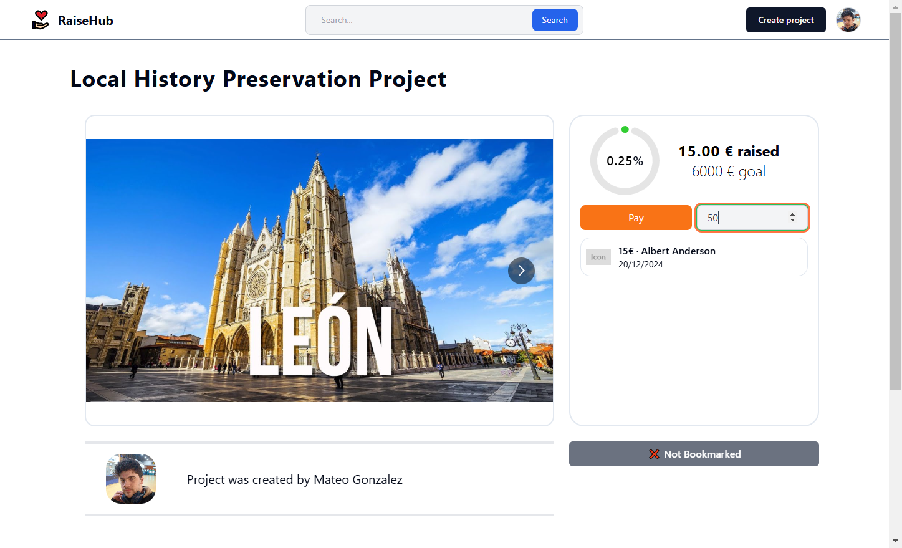
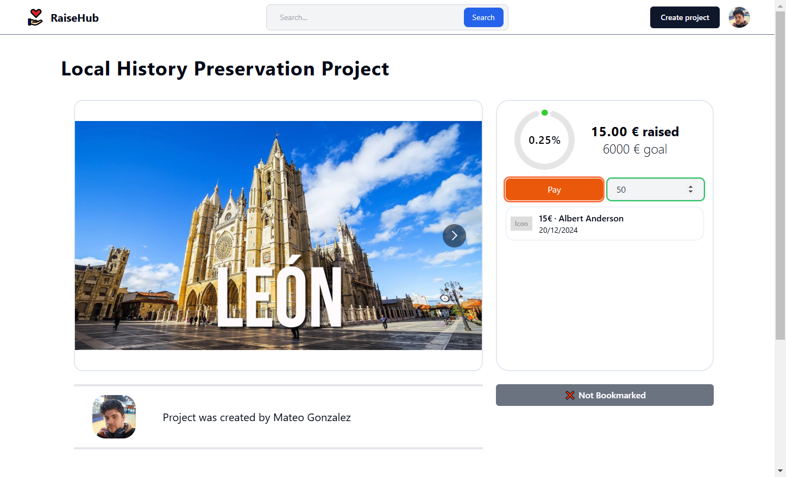
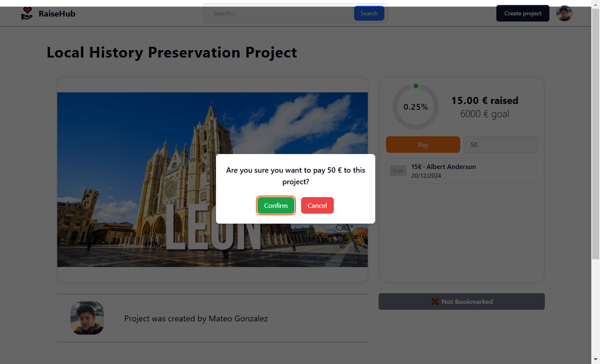
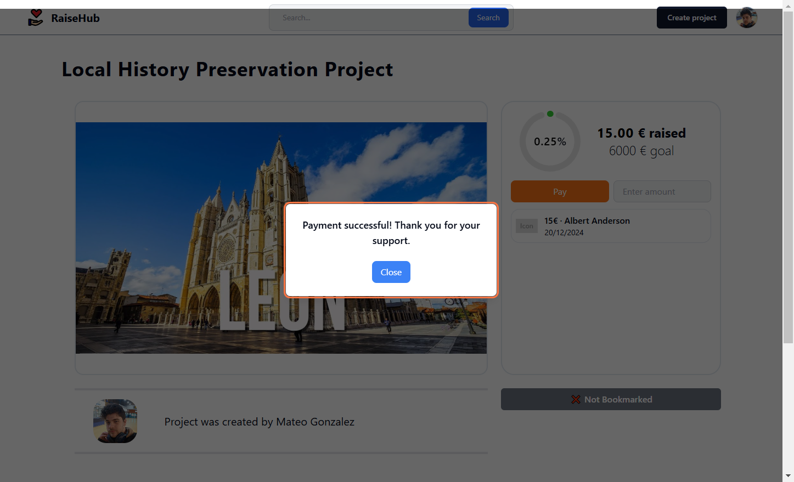

# How to Make a Payment

This guide explains how to contribute to a project by making a payment. Follow these steps to support a project on RaiseHub.

---

1. **Select the Project and Enter the Payment Amount**  
   Navigate to the project page you want to support. Enter the amount you wish to contribute in the designated field.  

2. **Initiate the Payment**  
   Click the **Pay** button to proceed with the payment.  

3. **Confirm the Payment**  
   Press the **Confirm** button to finalize your contribution.  

4. **Wait for Payment Confirmation**  
   Allow the system to process your payment. Once successful, you will see a confirmation message.  

5. **Reload the Project Page**  
   Refresh the project page to see your payment listed under the project’s payment history.  

