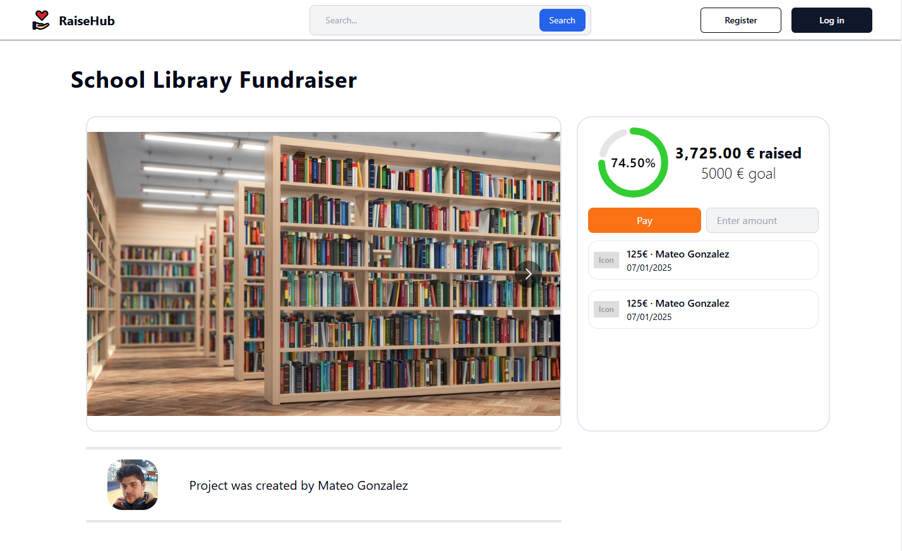

# How to view a project

This guide explains the different ways to view project details in RaiseHub

---

## Viewing Projects from the Landing Page

### Highlighted and New Projects
The landing page features two lists of projects:
1. **Highlighted Projects**: These are the projects closest to reaching their funding goals.
2. **New Projects**: These are the most recently added projects.

To view the details of a project, click on any project from these lists.

---

### Viewing Projects via the Table
At the bottom of the landing page, there is a table displaying all available projects. The table includes options for filtering and sorting projects.

To view a project from the table, click on the project’s card.  

---

### Navigating Through Projects
To view additional projects, use the pagination controls at the bottom of the table. Click the "Next Page" button on the right to load more projects.  

---

## Filtering and Sorting Projects
The table allows users to refine the project list using filters:
- **Percentage Funded**: Filter projects by how much funding they have received.
- **Type (Category)**: Filter by project category.
- **Sorting Method**: Sort projects based on criteria such as funding progress or creation date.

Apply filters to narrow down the projects displayed in the table.  

---

## Searching for Projects
To search for specific projects, use the search bar at the top of the page:
1. Type part of the project name in the search bar. For example, type “gard” to find gardening-related projects.  
   
2. Click the **Search** button or press the **Enter** key to display matching projects.  
   
3. View the search results, which include projects containing "gard" in their names.  
   

---

## Viewing Project Details
When you click on a project, you will be redirected to the project’s detail page. This page includes:
- The project's description.
- The total amount of money raised.
- The funding goal.

Use this page to explore the project in detail and decide whether to contribute.